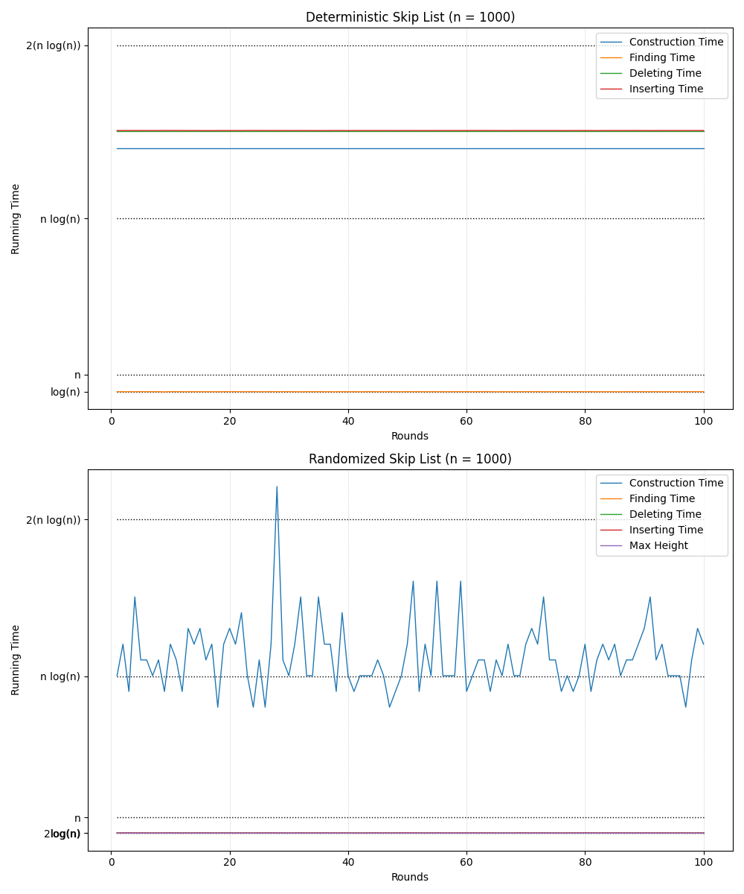

# Benchmarking Randomized SkipLists vs Deterministic SkipLists

```bash
mkdir -p build && cd build
```

```bash
cmake ..
```

```bash
make 
```

```bash
./SkipLists 1000 100 true
```

```python
python3 plot.py
```



# SkipLists: A Randomized Search Data Structure

## Why Use randomized SkipLists?
Deterministic search data structures, such as AVL trees, have predictable but sometimes inefficient behaviors regarding space and sophisticated rebalancing. Randomized SkipLists introduce probabilistic balancing, reducing insertion and deletion complexity while maintaining an efficient search performance.

## Key Concepts
### Deterministic SkipLists
1. **Structure**: SkipLists maintain a hierarchy of linked lists, where each higher-level list "skips" over more elements.
2. **Search**: Starts at the highest list and moves downward when an element more significant than the target is encountered.
3. **Worst-case search time**: `O(log n)` due to the logarithmic number of lists.
4. **Insertion and Deletion**: `O(n)` because of rearranging without sorting.

### Randomized SkipLists
1. **Randomization Strategy**:
   - Let the number of lists each element appears in be determined by a randomized process (fair coin flip).
2. **Expected Properties**:
   - **Height**: `O(log n)` whp (with high probability).
   - **Search Time**: `O(log n)` expected, leveraging probabilistic balancing.
   - **Insertion and Deletion**: Each operation takes `O(log n)` whp due to the logarithmic height constraint.

## Algorithm Details
### Construction of Randomized SkipLists
1. **Sort elements and create the base list**.
2. **For each element, flip a fair coin** until it lands on heads; the number of tails determines the number of additional lists.
3. **Connect each list by the respective pointers**
The construction is a Monte Carlo Algorithm since failure if randomized SkipList is higher than `log n`, success otherwise. Therefore, we analyze E(H) and P(success).

### Search Algorithm
1. Start in the highest list.
2. If the next element in the current list is >x, go one list down. Otherwise, go to that next element.
3. Stop if the element was found or if it is stuck in list 0.

### Insertion and Deletion
- **Insertion**: Performed in `O(log n)` whp (with high probability) by inserting the new element into the appropriate lists based on the randomized level assignment.
- **Deletion**: Performed in `O(log n)` whp by removing references to the element from all its lists.
With high probability since the height of the list is in O(log n) whp.

## Complexity Analysis
- **Expected height**: `O(log n)`.
- **Search time**: `O(log n),` as constant amount of operations on every list --> `c * log n`
- **Insertion/Deletion**: `O(log n)` due to the self-balancing nature of the structure. The data structure has the same properties as before Insertion/Deletion.

